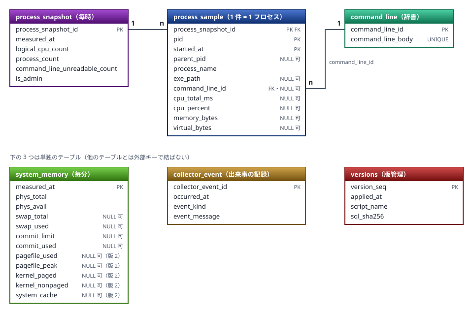

# メモリの時系列収集 — 計画

システム全体のメモリを 1 分ごと、全プロセスの状態を 1 時間ごとに SQLite へ記録し、毎日バックアップする

> 📅 作成: 2026-10-04 / 更新: 2026-10-06

[README へ戻る](../../README.md)

1. [この計画について](#1-この計画について)
2. [方式](#2-方式)
3. [データ](#3-データ)
4. [動き](#4-動き)
5. [手順](#5-手順)
6. [決めておくこととリスク](#6-決めておくこととリスク)

## 1. この計画について

### 目的

いまのレポートは「ある時点」の写真で、6 時間ごとにしか撮れない。**メモリがいつ・どのプロセスで増えたか**を後から追えるよう、時系列で残す。

### 作るもの

| # | 内容 | 間隔 |
|---:|---|---|
| 1 | システム全体のメモリ容量（物理・コミット・ページファイル）を SQLite に書く | 1 分ごと |
| 2 | 全プロセスの起動時刻・pid・CPU 累計・CPU 使用率・メモリなどを SQLite に書く | 1 時間ごと |
| 3 | DB のバックアップ。**zip** に固めて **100 世代**（毎日 1 回なので 100 日分）保持する | 毎日 23:59 |

### 決まっている方針

- **言語は Rust**。待機時のメモリが最小で（10-04 の実測: std のみで WS 4〜9 MB・プライベート 0.8 MB。Go は 7.4 MB・11.8 MB、node は約 34 MB・18 MB）、単一の実行ファイルで配れる
- **PowerShell は使わない**
- **圧縮は言語側の機能**（zip）。外部の 7z は使わない
- **Windows は winsw でサービス化する**。`ai-chat-lite` の構成を参考にする。Linux・Mac のサービス化は別途
- **Mac・Linux でも動く作りにする**。収集の部分だけを OS ごとに分け、DB・スケジュール・バックアップは共通にする

### この計画でやらないこと

- **Linux・Mac のサービス化と、その実機での確認**。ビルドが通り、収集が動く形までにとどめる
- **DB の古いデータの間引き**。サイズが問題になってから判断する（「決めておくこととリスク」を参照）
- **既存のレポート生成（6 時間ごと）の変更**。そのまま動かす

## 2. 方式

### 言語の比較（10-04 の検討）

| 候補 | 待機時のメモリ | 評価 |
|---|---|---|
| ✅ **採用** Rust | WS 4〜9 MB | プロセス・メモリ・CPU を OS 共通で取れる `sysinfo`、SQLite 同梱の `rusqlite`、`zip` があり、FFI も PowerShell も要らない。`ai-chat-lite` に Rust 版 CLI と winsw の前例がある |
| Go | WS 7.4 MB | 次点。プロセス情報に外部ライブラリが要り、言語がもう 1 つ増える |
| node（`node:sqlite` ＋ koffi） | WS 約 34 MB | PowerShell を使わないと、Windows のプロセス一覧を FFI で自作することになり、実装が重い |
| bun（`bun:ffi`） | WS 約 17 MB（プライベート約 70 MB） | node と同じ理由。共通ルールの node 併用も満たせない |

### 常駐 1 本で、3 つの周期を動かす

1 分ごとの起動をタスクスケジューラで行うと、**履歴が 1 日で約 8,600 件**増え、他のタスクの履歴まで流れ消える（いまのログは約 4 日分しか残らない）。このため、**常駐する 1 つのプロセス**が、1 分・1 時間・23:59 の 3 つの周期を内部で動かす。

### ビルドの環境（10-04 に判明）

この PC の PATH 上の `rustc` は、**GNU 構成のオフライン版**（`rust-offline`）で、C コンパイラ・アセンブラが無く、SQLite 同梱（`rusqlite`）をビルドできなかった。このため、**rustup（`C:/Tools/rust`）に MSVC ツールチェーンを追加**した（`rustup toolchain install stable-x86_64-pc-windows-msvc --profile minimal`。Visual Studio 2022 の `cl.exe` を使う。既存の GNU 版は残り、PATH 上の `rustc` には影響しない）。

- プロジェクトは `src/pc-memory-collector/rust-toolchain.toml` で MSVC を指定する。ビルド・テストは `tools/20_build/rust-env.ps1`（rustup の置き場を指す）を経由する
- rustup の置き場が違う環境では、環境変数 `PC_MEMORY_RUST_ROOT` で指す

### 置き場所

| もの | 場所 | 備考 |
|---|---|---|
| ソース | `src/pc-memory-collector/` | Rust のプロジェクト。`Cargo.lock` も Git に入れる。`target/` は管理外にする |
| DB | `_data/pc-memory.db` | 先頭 `_` は Git 管理外（`ai-chat-lite` と同じ置き方） |
| バックアップ | `_backup/pc-memory-yyyymmdd.zip` | 同上 |
| サービスの置き場 | `deploy/` | **共通ルールの「デプロイ定義」の置き場**（ai-chat-lite が向かう先と同じ。課題 i260830-01）。定義の XML は Git に入れる。**exe（ビルドした本体・winsw の複製）とログは、同じ `deploy/` に置くが Git に入れない**（`.gitignore`）。ビルド出力は Rust の既定の `target/`、本体は `build-pc-memory-collector` が `deploy/` へ写す。導入は実体のパス（subst ではない）で行う（10-06 に `_bin/` と `tools/80_ops/winsw/` から移した） |

## 3. データ

### テーブル

日時はすべて <strong>JST の `yyyy/mm/dd hh:mm:ss.ccc`（固定 23 文字の TEXT）</strong>で持つ。`ai-chat-lite` の DB に合わせた形（共通ルール「アプリケーションログの日時形式」と同じ書式）。固定長なので、**文字列の辞書順がそのまま時系列順**になり、DB を直接見ても読める。プログラムの中の計算は ms のままで、DB に書く・読むところだけで変換する。列名・日時・NULL の決まりは、この章の「命名と日時の決まり」にまとめた。

| テーブル | 列 |
|---|---|
| `system_memory` | measured_at（主キー）、物理の合計・空き、コミットの上限・使用量、ページファイルの合計・使用量（OS に無い値は NULL） |
| `process_snapshot` | process_snapshot_id、measured_at、論理 CPU 数、プロセス数、コマンドラインが取れなかった数、**昇格した権限で書いたか（is_admin）** |
| `process_sample` | process_snapshot_id、pid、親 pid、**起動時刻（started_at）**、プロセス名、実行ファイルのパス、**コマンドライン（`command_line` テーブルの id）**、**CPU 累計（ミリ秒）**、**CPU 使用率**、物理メモリ（WS）、仮想メモリ（`sysinfo` がスレッド数を返さないため、スレッド数は持たない）。パスとコマンドラインの**ユーザープロファイルは `~` に置換**して書く |
| `command_line` | command_line_id、本文（**重複を持たない**）。同じプロセスのコマンドラインは毎時間ほぼ同じで、長いもの（Electron 系は 2 KB を超える）もあるため、`process_sample` には id だけを入れる |
| `collector_event` | collector_event_id、occurred_at、種別（開始・停止・エラー・バックアップ）、内容 |
| `versions` | version_seq（主キー）、applied_at、script_name、sql_sha256。**どの版まで当てたか**を持つ（次の「スキーマの版管理」を参照） |

### テーブル定義（版 1。手順 14 で、命名と日時を直した形）

正は `src/scripts/20_migrate/ver_000001/001-initial.sql`（`system_memory` の版 2 の列は `ver_000002/001-system-memory-detail.sql`）。全テーブルを `STRICT`（型を守らせる）にする。**サイズは byte、日時は JST の 23 文字 TEXT**。OS に無い値は NULL にする。

#### 関係



線の **1** と **n** は、1 件に対して何件がぶら下がるか（`process_snapshot` 1 件に `process_sample` が多数、`command_line` 1 件を多数の `process_sample` が参照）。**PK** は主キー、**FK** は他のテーブルへの参照、**NULL 可** は値が無いことがある列。`versions` だけは、版 1 の SQL ではなく、起動時にプログラムが作る。

#### `system_memory`（1 分ごとのシステム全体）

| 列 | 型 | NULL | 内容 |
|---|---|---|---|
| `measured_at` | TEXT(23) 主キー | 不可 | 取得時刻（JST）。1 分ごとの行がそのまま収集の生存確認になる |
| `phys_total` | INTEGER | 不可 | 物理メモリの合計 |
| `phys_avail` | INTEGER | 不可 | 物理メモリの空き |
| `swap_total` | INTEGER | 可 | スワップの合計。Windows ではページファイルの合計 |
| `swap_used` | INTEGER | 可 | スワップの使用量。**実際のページファイルの使用ではなく、「コミットの使用量 − 物理メモリの合計」の計算値**（実際の値は、版 2 の `pagefile_used`） |
| `commit_limit` | INTEGER | 可 | コミットの上限（Linux・Mac で取れないときは NULL） |
| `commit_used` | INTEGER | 可 | コミットの使用量 |

索引は主キーのみ（`measured_at` での範囲検索はこれで足りる）。

##### 版 2（10-07）: システム全体の内訳を足す（課題 i261007-01 の 2-A）

10-06 23:23 のコミットの急増を、あとから追えるように、`system_memory` に列を足す（`ALTER TABLE … ADD COLUMN`。`ver_000002/`。導入済みの DB には、版を上げる前に控えを取ってから当てる）。すべて NULL 可（OS に無い値）。

| 列 | 型 | 内容 |
|---|---|---|
| `pagefile_used` | INTEGER | **実際のページファイルの使用量**（Windows は `NtQuerySystemInformation` の `SystemPageFileInformation`）。`swap_used` は計算値なので、こちらを見る |
| `pagefile_peak` | INTEGER | ページファイルの使用量のピーク（起動してからの最大） |
| `kernel_paged` | INTEGER | カーネルのページプール（`GetPerformanceInfo` の `KernelPaged`） |
| `kernel_nonpaged` | INTEGER | カーネルの非ページプール（`KernelNonpaged`） |
| `system_cache` | INTEGER | システムキャッシュ（`SystemCache`） |

**実装（10-07）**: ページファイルは、`ntdll` の `NtQuerySystemInformation`（種別 18）を直接呼び、すべてのページファイルの使用量とピークを合計する（ページ単位 × ページの大きさ）。ページファイルが 1 つも無いときは、0 ではなく NULL。カーネルのプールとキャッシュは、`GetPerformanceInfo` の値。Linux・Mac は、実機で確かめられないため、すべて NULL。過去の行は、取っていなかったので NULL のまま。

**「コミット − プロセスの仮想メモリの合計」は、列にしない**（毎時のスナップショットと、同じ分の `system_memory` から計算できる）。Linux・Mac は、まだ実装しない（NULL）。

#### `process_snapshot`（1 時間ごとの親）

| 列 | 型 | NULL | 内容 |
|---|---|---|---|
| `process_snapshot_id` | INTEGER 主キー | 不可 | スナップショットの番号 |
| `measured_at` | TEXT(23) | 不可 | 取得時刻（JST） |
| `logical_cpu_count` | INTEGER | 不可 | 論理 CPU 数。CPU 使用率の計算に使う（その時点の値を残す） |
| `process_count` | INTEGER | 不可 | プロセス数 |
| `command_line_unreadable_count` | INTEGER | 不可 | コマンドラインが取れなかった数。**黙って欠けないため**に持つ（権限が足りないと増える） |
| `is_admin` | INTEGER (0 / 1) | 不可 | **管理者権限（昇格済み、または LocalSystem）で動いていたか**。UAC で昇格していない管理者アカウントは 0。`CHECK (is_admin IN (0, 1))`。権限で、読めなかったプロセスの数が大きく変わる（非管理者の実測: 568 件中およそ 260 件）ため、あとから区別できるように持つ。判定は、Windows ではトークンの昇格状態（`GetTokenInformation` の `TokenElevation`）、Linux・Mac は、まだ実装しない（実機で確かめられないため、常に 0 とし、対応は別に行う）。**昇格の状態は、プロセスが動いている間は変わらない**。`system_memory` には持たない（権限に左右されない。非管理者の実測で全列が埋まった）。その行の権限を知りたいときは、直前の開始イベントを見る |

索引: `process_snapshot_ix_measured_at`（`measured_at`）。

#### `command_line`（コマンドラインの辞書）

| 列 | 型 | NULL | 内容 |
|---|---|---|---|
| `command_line_id` | INTEGER 主キー | 不可 | 番号 |
| `command_line_body` | TEXT UNIQUE | 不可 | 本文（`~` に置換済み）。**同じ文字列は 1 行だけ**。毎時間ほぼ同じで長いため、`process_sample` は id で参照する |

#### `process_sample`（プロセス 1 件が 1 行）

| 列 | 型 | NULL | 内容 |
|---|---|---|---|
| `process_snapshot_id` | INTEGER 主キー(1) | 不可 | `process_snapshot.process_snapshot_id` への参照（**参照先の主キーと同じ名前**） |
| `pid` | INTEGER 主キー(2) | 不可 | プロセス ID |
| `started_at` | TEXT(23) 主キー(3) | 不可 | 起動時刻（JST）。**pid は再利用される**ため、必ず組み合わせて同じプロセスを見分ける |
| `parent_pid` | INTEGER | 可 | 親の pid |
| `process_name` | TEXT | 不可 | プロセス名 |
| `exe_path` | TEXT | 可 | 実行ファイルのパス（`~` に置換済み。権限が無いと NULL） |
| `command_line_id` | INTEGER | 可 | `command_line.command_line_id` への参照。取れなければ NULL |
| `cpu_total_ms` | INTEGER | 可 | CPU 時間の累計（ミリ秒）。**読めなかったプロセスは NULL**（下の注） |
| `cpu_percent` | REAL | 可 | 前回のスナップショットとの差から出した、全体に対する割合。**前回が無ければ NULL** |
| `memory_bytes` | INTEGER | 可 | 物理メモリ（Windows ではワーキングセット）。**読めなかったプロセスは NULL** |
| `virtual_bytes` | INTEGER | 可 | 仮想メモリ。**読めなかったプロセスは NULL** |

> [!IMPORTANT]
> <strong>注: 権限が無くて読めなかったプロセスの値は、0 ではなく NULL で書く。</strong>非管理者での実測（568 件）で、261 件（OS の中核: System・csrss・smss・winlogon 等）は、メモリと CPU 累計が 0、実行ファイルのパスが無い、の 3 つが完全に一致した。0 で書くと「使っていない」「暇だった」と読めて、平均や合計を狂わせる。判定は **メモリが 0 で、かつパスが取れていない**こと（パスが取れていれば、0 は本当の 0）。集計では、`AVG`・`SUM` は NULL を飛ばす。`command_line` との結合は `LEFT JOIN` にする（内部結合は `command_line_id` が NULL の行を落とす）。
> `cpu_percent` は、前回が無い・前回か今回が読めなかったときも NULL。
> ✅ **決定** 読めなかったプロセスの `started_at` は、`sysinfo` が起動時刻に 0 を返すため、`1970/01/01 09:00:00.000` で書かれる（実測）。主キーの一部なので NULL にはできない。**そのまま書く**（10-06 に決定）。読めなかった行は、メモリ・CPU が NULL なので、`started_at` が 1970 年なら「読めなかった行」と分かる。

主キーは `(process_snapshot_id, pid, started_at)`（`WITHOUT ROWID`）。索引: `process_sample_ix_pid_started_at`（`pid, started_at`）。**同じプロセスの時系列を引くのに使う**。

#### `collector_event`（収集の出来事）

| 列 | 型 | NULL | 内容 |
|---|---|---|---|
| `collector_event_id` | INTEGER 主キー | 不可 | 番号 |
| `occurred_at` | TEXT(23) | 不可 | 発生時刻（JST） |
| `event_kind` | TEXT | 不可 | 種別。現在の値は `start`・`stop`・`error`・`backup` の 4 つ（制約は付けていない） |
| `event_message` | TEXT | 不可 | 内容（日本語の文） |

索引: `collector_event_ix_occurred_at`（`occurred_at`）。

#### `versions`（版管理）

| 列 | 型 | NULL | 内容 |
|---|---|---|---|
| `version_seq` | INTEGER 主キー | 不可 | 当てた版の番号 |
| `applied_at` | TEXT(23) | 不可 | 当てた時刻（JST） |
| `script_name` | TEXT | 不可 | 当てた SQL のファイル名 |
| `sql_sha256` | TEXT | 不可 | SQL の指紋（SHA-256。64 文字の検査付き） |

版 1 の SQL には含まれず、起動時にプログラムが `CREATE TABLE IF NOT EXISTS` で作る（「どこまで当てたか」を持つ表なので、SQL の中には置けない）。

### 命名と日時の決まり（`ai-chat-lite` に合わせる）

日時の形式・列名・NULL の扱いは、共通ルール「DB 定義のルール」に従う（`ai-chat-lite` の DB に合わせた形。決めたのは 10-06 で、10-07 に共通ルールへ上げた）。**ここには、このプロジェクトの決めと、ルールが任せている点だけ**を書く。

| 点 | このプロジェクトの決め |
|---|---|
| 許容する略語 | `pid`・`parent_pid`（OS の用語）、`phys`・`avail`、`exe_path`。`ts` → `measured_at`、`cmdline` → `command_line` のように、それ以外は書き下す |
| 単位 | `system_memory` の列は、単位の `_bytes` を付けない（版 1 の SQL の先頭に「サイズは byte」と書く）。`process_sample` は、`memory_bytes` 等、語尾に付ける |
| テーブル名 | 単数（`system_memory` のように、複数形が不自然なものがあるため）。`ai-chat-lite` は複数形 |
| NULL の理由 | 権限が無くて読めなかったプロセスのメモリ・CPU 累計は NULL（前の「注」）。判定は「メモリが 0 で、かつパスが取れていない」 |
| swap の列 | `swap_total` はページファイルの大きさと一致するが、**`swap_used` は、`sysinfo` が返す「コミットの使用量 − 物理メモリの合計」の計算値**（実際のページファイルの使用ではない）。版 1 は導入済みで書き換えられないため、版 2 で実際の値を足す |

### スキーマの版管理

共通ルール「DB 定義のルール」の「版管理」に従う。このプロジェクトの具体的な形を、次に書く。DB の形は、版で管理する。`CREATE TABLE IF NOT EXISTS` は、既にあるテーブルを作り替えない。列の削除・型の変更は、テーブルを作り直すしかなく、そのたびに専用の手順を書くことになる。**SQL を版ごとのフォルダに置き、`versions` テーブルに「どこまで当てたか」を持つ**形にする。

| 決まり | 内容 |
|---|---|
| SQL の置き場 | `src/scripts/20_migrate/ver_000001/`、`ver_000002/` …（6 桁のゼロ埋め。共通ルールの置き場に従う）。1 つの版に複数の `.sql` を置け、名前順に当てる。**実行ファイルに埋め込む**（サービスは単独の実行ファイルで動かすため） |
| 番号は連続 | 飛んでいたら止める。飛んでいると、当て損ねに気づけない |
| 当てる時 | 起動時に、足りない分だけを順に当てる。**1 つの版を 1 つのトランザクション**で当て、失敗したら巻き戻して、起動を失敗させる（非 0 の終了コード） |
| 書き換えの検知 | 当て済みの SQL の指紋（SHA-256）を `versions` に持つ。**当て済みの版が書き換えられていたら止める**。環境ごとに形が違う状態になるのを防ぐ。変更は、新しい版として足す |
| 下りは持たない | SQLite は列の削除もできず、下りを正しく書き続けるのは重い。**版を上げる前に、`VACUUM INTO` で控えを取り**（`_backup/pre-ver-…`。毎日の 100 世代の整理の対象にしない）、戻すならそこから戻す |
| 初回 | 空の DB には、版 1 から順に当てる。`versions` が無いのに、すでにテーブルがある DB は、版 1 の形として記録する（当て直さない） |

### CPU 使用率の出し方

1 回の値からは出ない。**同じ起動時刻・同じ pid のプロセスの、前回の CPU 累計との差**を、経過時間と論理 CPU 数で割って出す（タスクマネージャーと同じ、全体に対する割合）。前回が無いプロセス（新しく現れた）は NULL にする。pid は再利用されるため、起動時刻を必ず組み合わせる。

### サイズの見積り（未測定の概算）

| 項目 | 見積り |
|---|---|
| `system_memory` | 1 日 1,440 行 × 約 80 バイト ≒ 0.1 MB/日（年 約 40 MB） |
| `process_sample` | 1 日 24 回 × 約 450 プロセス × 約 120 バイト ≒ 1.3 MB/日（年 約 470 MB） |
| `command_line` | 重複を持たないため、増えるのは**新しい文字列が現れた分だけ**。同じ文字列を毎時間書くと、1 行 200〜2,000 バイトで年 数 GB になる見込みが、初回の分（数百 KB〜数 MB）と、起動のたびに変わるものの分に収まる（未測定） |
| バックアップ | 毎日 DB 全体を zip にするため、**世代の合計は DB の成長とともに増える**。半年後の DB が約 250 MB、zip で 1/4〜1/6 とすると、100 世代で約 5〜6 GB |

実測してから、間引きや差分バックアップを判断する。

## 4. 動き

### 収集

- **1 分ごと**: 毎分 0 秒に合わせて、システムのメモリを 1 行書く。スリープ明けなどで抜けた分は、さかのぼって埋めない（抜けたこと自体が、行の欠けとして残る）
- **1 時間ごと**: 毎時 0 分に、全プロセスを 1 スナップショットとして書く。CPU 使用率は、同じ時刻の DB 内の前回分から計算する
- **起動した時刻から数えず、時計の区切りで動く**（10-06 に追加）。10 秒間隔なら `:00 :10 :20` …、毎分は `hh:mm:00`、毎時は `hh:00:00`。起動が 00:12:34 で 10 秒間隔なら、**最初の実行は 00:12:40**。起動の途中の区切りは書かず、次の区切りから書く。ミリ秒の数 ms のずれは許容する（実測: 10 秒間隔で `:10.001`・`:20.000`）。次に動く時刻は、メモリとプロセスの区切りの近いほう。**代償:** 起動の直後に、メモリは最大 1 分、プロセスのスナップショットは最大 1 時間、行が無い期間ができる。試験で `--once` を使うときは、`--memory-interval-sec 1` を付けると待たない
- **コミット・ページファイルは OS ごとの取り方**。Windows は `GetPerformanceInfo` 等（`windows-sys` で 1 関数）、Linux は `/proc/meminfo`、Mac は無い値を NULL にする
- <strong>コマンドラインを記録する。</strong>サービスは **LocalSystem** で動かす想定。**非管理者の実行ではコマンドラインが取れなかった前例がある**（レポートで 267 件）ため、取れるかどうかは重要な確認点になる。取れなかったプロセスは NULL にし、**取れなかった件数をスナップショットに残す**（黙って欠けない）。全プロセスが見えるかは、実機で確かめる

### バックアップ

1. **バックアップの前に、WAL を掃除する**（10-06 に追加）。`PRAGMA wal_checkpoint(TRUNCATE)` で、`-wal` を本体へ統合して 0 に縮める。`-wal` は、書き込みの確定のたびに、約 4 MB（1000 ページ）で自動的に本体へ統合されるが、**DB を開いたままの読み取り（閲覧ツールの放置等）があると統合が進まず、大きくなり続ける**。いったん大きくなると、そのままの大きさで残るため、**開くときに `journal_size_limit` を 64 MB に決める**。ファイルは 3 つ（`.db`・`-wal`・`-shm`）のままで、増えない。掃除できなかったとき（読み取りが開いたまま）は、**バックアップも収集も止めず**、エラーのイベントに残す
2. 毎日 23:59 に、`VACUUM INTO` で稼働中の DB から、整合の取れたコピーを 1 ファイルで作る（`-wal` / `-shm` を別に扱わなくてよい。10-04 に動作を確認済み）
3. そのコピーを `PRAGMA integrity_check` で検査する
4. zip（deflate）にして、一時名で書いてから `pc-memory-yyyymmdd.zip` へ名前を変える（途中で止まっても、壊れた zip を世代に残さない）
5. **新しい世代を書き終えてから**、古い世代を消す。100 を超えた分だけを、名前の古い順に消す
6. 結果を `collector_event` に書く。**失敗したら、エラーとして残し、翌日の分を止めない**

### サービス（Windows）

`ai-chat-lite` の winsw の定義に倣う。

- 実行ファイル名を専用の名前（`rust-ai-pc-memory-collector.exe`）にして、プロセス一覧で区別できるようにする
- 異常終了（コード 0 以外）なら 10 秒後に再起動（3 段）。ログは `%BASE%\logs` にサイズで回す。自動起動
- **install は実体のフォルダで行う**（subst のドライブはサービスから見えない）。管理者権限が要る
- 致命的な失敗（DB が開けない等）は、**0 以外の終了コードで終わり**、再起動に任せる
- 停止は **Ctrl+C 相当**（winsw の既定）で受け、停止イベントを DB に書いて終了コード 0 で終わる（10-04 に実機で確認）。`taskkill`（ウィンドウ向けの終了要求）では停止イベントが書かれないが、サービスの停止の経路ではない

### exe の置き替え（動いているサービスの exe を、止めずに置く）

サービスが動いている間は、`deploy/` の exe が掴まれていて、上書きも削除もできない。**Windows は、実行中の exe の名前を変える（退避する）ことはできる**ので、次の順で置き替える（10-06 に決定。ai-chat-lite の `place-exe.mjs` と同じ考え方で、退避先は `tmp/`）。

1. **ビルドして置く**: `tools/20_build/build-pc-memory-collector.cmd`。ビルドしたあと、`deploy/` の動いている exe を `tmp/rust-ai-pc-memory-collector-old-<日時>.exe` へ退避し、新しい exe を置く。前回までに退避して、もう掴まれていないものは、この時に消す。<strong>ここまでは、サービスを止めない。</strong>動いているプロセスは、退避した旧い exe のまま動き続ける
2. **切り替える（管理者は要らない）**: 再起動を、受信箱の依頼で行う（次の「依頼の受信箱」）。`tools\80_ops\request-restart.cmd`、またはビルドと一緒に `build-pc-memory-collector.cmd -Restart`。新しい exe で動き始め、`comp/` に新しい版が書かれる（10-07 に実機で確認）。<strong>再起動の間（約 10 秒。winsw の待ち）は、収集が止まる。</strong>区切り（毎分）をまたいだ分は、さかのぼって埋めず、行の欠けとして残る。切り替えは、区切りの直後（毎分 5〜10 秒）に行うと、欠けない。**受信箱を持たない古い版が動いているときだけ**、管理者の `deploy\rust-ai-pc-memory-collector-winsw.exe restart` で切り替える
3. **確かめる**: 開始のイベント（`collector_event`）に、新しい開始の行が増え、1 分後に `system_memory` の行が増えること。検知（`check-pc-memory-collector`）が正常のままであること

導入スクリプト（`install-pc-memory-collector-service.cmd`）は、サービスの**登録の作り直し**（定義や winsw を変えたとき）に使う。exe だけを替えるときは、上の手順にする（登録を作り直さない）。

### 依頼の受信箱（再起動の依頼を、ファイルで受け取る）

exe の置き替えのあとの切り替えに、管理者の操作が要らないようにする（10-06 に決定）。収集はポートを待ち受けないので、**フォルダを監視して、依頼のファイルを受け取る**。収集本体が自分で終了し、winsw の「異常終了なら 10 秒後に再起動」が、新しい exe で起動し直す。

#### ファイルの流れ

```
_data/request/inbox/req-20261006-233700.tmp    依頼者が書く（書きかけ。読ませない）
        ↓ 書き終えたら、名前を変える
_data/request/inbox/req-20261006-233700.json   依頼
        ↓ 収集本体が見つけて、名前を変えて受け取る
_data/request/proc/req-20261006-233700.json    処理中
        ↓ 結果
_data/request/comp/req-20261006-233700.json    完了（結果を書き足す）
_data/request/error/req-20261006-233700.json   失敗（理由を書き足す）
```

- **置き場**は `_data/request/{inbox,proc,comp,error}`（Git 管理外）。**ファイル名**は `req-yyyymmdd-hhmmss.json`（JST。同じ秒に 2 件なら、末尾に `-2` 等の連番）
- **依頼の中身**は `{"action":"restart"}`。**動作は `restart` で始め、10-07 に `inspect` を足した**（次の「依頼 `inspect`」。`checkpoint` 等は、必要になってから足す）。任意の `note`（依頼の理由。200 文字まで）を書ける
- **受け取る**のは、`inbox/` の `req-*.json` だけ。`.tmp` は無視する。**名前を変える操作（rename）で受け取る**ので、同時に 2 回受け取ることはない

#### 監視の方法（`fs.watch` のような、OS のファイル監視）

- `inbox/` を OS のファイル監視で見る（Rust の `notify` クレート。Windows は `ReadDirectoryChangesW`、Linux は inotify、Mac は FSEvents）。**ポーリングではなく、変更の通知で待ちを起こす**。いまの「0.5 秒刻みの待ち」を、通知か区切りの時刻の、早いほうを待つ形に置き換える
- **通知の取りこぼしに備え、安全網を持つ**: ①起動時に `inbox/` を 1 回走査する（止まっている間に置かれた依頼）、②区切りごと（毎分）にも 1 回走査する。通知は「起こすきっかけ」で、受け取りは、必ず走査で行う
- **追加のライブラリが 1 つ増える**（`notify`）。待機時のメモリは、増加を実測して記録する（今は WS 約 8 MB）

#### 再起動の流れ

1. 依頼を `proc/` へ移し、**停止のイベントを書き**、DB を閉じて、**終了コード 75** で終わる（`EX_TEMPFAIL`。0 以外なので、winsw の `onfailure restart` が起動し直す）
2. 新しいプロセスは、起動時に `proc/` に残った再起動の依頼を見つけ、**`comp/` へ移して、新しい版（`version`）と完了の時刻を書き足す**。`comp/` に新しい版が書かれていれば、**新しい exe で動いている証拠**になる
3. 再起動の間（winsw の待ちが 10 秒）、収集は止まる。毎分の行が 1〜2 件欠けうる（さかのぼって埋めない）
4. サービスではなく手で動かしているときは、終了するだけ（誰も起動し直さない）。依頼の結果には、その旨を書く

#### 安全性

- <strong>依頼から、コマンドは実行しない。</strong>動作の名前を、決まった一覧（`restart`・`inspect`）と照合する
- 次のものは、`error/` へ移し、理由を書き足す: JSON として読めない・大きさが 4 KB を超える・`action` が一覧に無い・名前が `req-*.json` の形でない・`note` が長すぎる。**黙って捨てない**
- 前回の再起動の依頼が `proc/` に残っていて、再起動以外・読めないものは、`error/` へ移し「中断された」と書く
- `inbox/` は、ログオンしたユーザーが書ける（`_data/` の権限）。サービスは LocalSystem で動くので、**依頼できる動作を最小にして、被害を再起動 1 回に限る**

#### 後始末・道具

- `comp/` と `error/` は、バックアップと同じく、古いものから消す（それぞれ 100 件まで）
- **依頼を出す道具**: `tools/80_ops/request-restart.ts`（`.cmd` のランチャー付き）。`.tmp` に書き、名前を変え、`comp/` か `error/` に出るまで待ち（60 秒）、結果を表示する。終了コード 0 は完了、1 は失敗・時間切れ
- **ビルドとつなぐ**: `build-pc-memory-collector` に `-Restart` を足し、置き替えのあとに、この道具を呼ぶ。**ビルド → 退避 → 配置 → 再起動**が、管理者なしの 1 コマンドになる

#### 依頼 `inspect`（いまのプロセスの状態を、依頼で調べる。10-07 に承認）

毎時のスナップショットを待たずに、「いま、どのプロセスがメモリを使っているか」を調べる。コミットが急に増えたとき（i261007-01）に、1 時間後ではなく、その場で犯人を探すため。受信箱の流れは再起動と同じで、**プロセスは終了しない**。

- **依頼の中身**（3-A）: `{"action":"inspect","top":20,"sort":"commit"}`。`sort` は `commit`（既定）か `working_set`。`top` は 1〜100（既定 20）。範囲外・知らない `sort` は `error/` へ理由つきで移す。`note` は再起動と同じ（200 文字まで）
- **返すもの**（1-A）: **上位 N 件**のプロセス（`pid`・`process_name`・`commit_bytes`・`working_set_bytes`・`started_at`・`parent_pid`）と、システム全体の値（`system_memory` の全項目）。**コマンドラインは返さない**（結果のファイルにも、資格情報を残さない）。読めなかったプロセスの値は、0 ではなく null
- **結果の置き場**（2-A）: `comp/` の完了のファイルに、`result` として書き足す（依頼と結果が 1 組になる）。DB には書かない（毎時のスナップショットと混ざらない）
- **流れ**: 受け取って `proc/` → その場でプロセスの一覧を取り、書き足して `comp/`。再起動と違い、終了コード 75 では終わらず、収集は続く。`comp/`・`error/` の 100 件の枠は共通
- **依頼を出す道具**: `tools/80_ops/request-inspect.ts`（`.cmd` 付き。`request-restart` と同形）。結果を表で表示する。引数は `top:`・`sort:`
- **安全性**: 依頼から、コマンドは実行しない。動作の一覧が `restart` と `inspect` の 2 つになる。`inspect` は読み取りだけで、被害は、一覧を取る負荷（数百 ms）に限る

### 検知（無言で止まらないために）

1 分ごとの行が**そのまま生存確認**になる。**別の検知用タスク**（`check-pc-memory-collector.ts`。10 分ごと）が、DB を読み取り専用で開いて次の 2 点を見る。結果は `logs/check-pc-memory-collector.log` に残す。

- `system_memory` の最新の行が 3 分より古ければ異常
- 直近の 23:59 の分のバックアップ（`pc-memory-yyyymmdd.zip`）が無ければ異常（作成中の 10 分は待つ。収集の開始が、そのスロットより後なら、まだ作る時刻が来ていないので正常）

レポート生成の検知と同じく、**最初の異常は「再確認待ち」としてログだけに残し、続けて異常のとき（次の 10 分後）だけ、トースト通知を出す**（スリープ明けの一時的な遅れで通知しないため）。レポートの検知とは別のタスクで、検知の周期が違うため、コードも別にした。

### 設定

間隔・バックアップ時刻・DB の場所は、**引数で変えられる**形にする（テストで 1 秒間隔などに縮めるため）。既定は上の仕様どおり。

**`--times <回数>`** で、周期を指定の回数だけ回して終わる（`--once` は `--times 1` と同じ）。**CPU 使用率は、同じプロセスが 2 回以上スナップショットに載らないと出ない**ため、確かめるには `--memory-interval-sec 10 --process-interval-sec 10 --times 3` のように回す（非管理者の実測: 1 回目は全件 NULL、2 回目以降は読めた 307 件に値が入り、読めない 260 件は NULL のまま）。

## 5. 手順

| # | やること | 状態 |
|---:|---|---|
| 1 | この計画の承認を受ける | ✅ **済** （10-04） |
| 2 | 課題と README に着手を反映する | ✅ **済** |
| 3 | **技術の確認**。`sysinfo` で、起動時刻・CPU 累計・メモリ・仮想メモリが取れ、管理者／サービスの権限で全プロセスが見えるかを、小さな試作で実測する（取れなければ、方式を見直す） | ✅ **済** （非管理者で: 起動時刻・CPU 累計・メモリ・仮想メモリ・exe・コマンドラインが取れた。`swap_total` はページファイルの合計と一致。**スレッド数は取れず、列から外した**。コマンドラインは 580 件中 310 件のみ（非管理者）。**サービス権限での見え方は手順 11 で確かめる**） |
| 4 | **先にテストを書く**（`cargo test`）。版の当て方（空の DB・当て済み・書き換えの検知・失敗時の巻き戻し・番号の飛び）・テーブルの作成・CPU 使用率の計算・コマンドラインの重複排除と `~` への置換・分／時の合わせ方・世代の整理（105 件から 100 件）・バックアップが整合した zip になること | ✅ **済** （`cargo test` 60 件。実装前に落ちることを確認した） |
| 5 | 版の当て方（`src/scripts/20_migrate/ver_000001/` の初期 SQL を含む）、DB・収集（メモリ・プロセス）・CPU 使用率を実装する | ✅ **済** （実機で、580 プロセス・コマンドライン重複排除・CPU 使用率が 2 回目から入ることを確認。**伏せ字の漏れ（Git bash 形式の `/c/Users/…`）を実データで見つけ、テストを足して直した**） |
| 6 | 周期の実行・イベントの記録・引数（間隔の変更）を実装する | ✅ **済** （実機で、5 秒・20 秒の間隔で動作。Ctrl+C で停止イベントを書いて終了コード 0。**強制終了後も DB は `ok`**） |
| 7 | バックアップ（`VACUUM INTO` → 検査 → zip → 世代の整理）を実装する | ✅ **済** （実機で、指定した時刻ちょうどに zip が 1 つだけ作られた） |
| 8 | winsw の定義と、導入手順（管理者で install）を作る | ✅ **済** （作成のみ。`deploy/`（定義の XML）・`tools/70_deploy/install-pc-memory-collector-service.cmd`・`tools/20_build/build-pc-memory-collector.cmd`。導入は手順 11） |
| 9 | 検知を、先にテストを書いて作る。**収集は別のタスク（10 分ごと）で検知する**（`check-pc-memory-collector.ts`。`register-check-task.ps1 -Target collector`） | ✅ **済** （実物の DB で、正常 → 再確認待ち → 異常＋トーストの流れを確認。登録は手順 11） |
| 10 | テストの一括実行（`tools/40_test/run-tests.ps1`）に `cargo test` を加える | ✅ **済** （ps1・node・bun・cargo の全件が通る） |
| 11 | **実環境で確かめる（稼働）**。サービスを install し、1 分ごとに行が増える・毎時にスナップショットが入る・プロセスを止めると 10 秒後に再起動する・再起動（OS）後に自動で起動する・止めると検知が異常を出す | ⚠️ **着手** （10-06 に導入。✅ 1 分ごとに行が増える（23:21 から欠けなし）・✅ 00:00 に毎時のスナップショットが入る・✅ 再起動後も続く（管理者の再起動と、受信箱の依頼の再起動）・✅ 登録された実行ファイルは `C:\work\…\deploy\…` で、subst ではない。✅ 検知タスク `ai-pc-check-pc-memory-collector` を登録し（10-07 06:57。10 分ごと）、タスクスケジューラから実際に 1 回動かして ✅ 正常（結果コード 0。ログ `logs/check-pc-memory-collector.log`）。✅ **強制終了後の再起動**（10-07 06:59:10 に、管理者が `taskkill /F` で収集本体を強制終了 → Windows が「予期せぬ終了。10 秒以内にサービスの再開」を記録 → 06:59:20.789 に新しい開始。**停止のイベントは無い**（強制終了なので書けない）。06:59 の行のあとに止まり、07:00 の行から続いて、**行の欠けは 0 件**。強制終了のあとも `integrity_check` は `ok`。検知も 07:00 で正常）。**残り: OS の再起動後に自動で起動するか・サービスを止めたときに、検知が異常とトーストを出すか**） |
| 12 | **実環境で確かめる（バックアップ）**。実際の 23:59 に zip ができ、翌日以降も世代が増え、100 を超えたら古い世代が消えること。**待ち時間が要る** | ⚠️ **着手** （✅ 初回の 10-06 23:59:00 に `pc-memory-20261006.zip`（3,469 byte）ができ、バックアップのイベントが残った。**残り: 翌日以降に世代が増えること・100 世代を超えたら古い世代が消えること**） |
| 13 | 実測した待機メモリ・DB のサイズ・全プロセスの見え方を記録し、計画・課題へ反映する | ⚠️ **着手** （10-07 の実測。**待機メモリ**: 収集本体が WS 8.3 MB・プライベート 1.8 MB、winsw のラッパーが WS 26 MB（受信箱とファイル監視を足したあとも、ほぼ変わらない）。**全プロセスの見え方**: コマンドラインが読めなかった数は、非管理者 272/567・管理者のコンソール 257/570・**サービス（LocalSystem）21/565**。メモリ・CPU が NULL になった数は、約 260・75・1。**残り: DB のサイズの伸び（数日分）**） |
| 14 | **命名と日時の形式を直す**（上の「命名と日時の決まり」）。**手順 11 の前に行う**（導入のあとは、DB の版 1 を書き換えられない）。先にテストを書き（日時が 23 文字の JST で書かれる・読まれる、列名、主キーと外部キーの名前、索引名）、落ちるのを確かめてから、`001-initial.sql`・`db.rs`・`migrate.rs`・`backup.rs`・`check-pc-memory-collector.ts`・テストを直す。DB はまだ無いので、移行は要らない。**あわせて、`process_snapshot.is_admin` を足す**（昇格した権限で書いたか。テストは、昇格の判定を差し替えられる形にして、0 と 1 が書かれることを確かめる）。開始イベントのメッセージにも「昇格あり／なし」を書く | ⚠️ **着手** （実装とテストは済。全件が通る。**非管理者の実機**で、23 文字の JST・列名・索引名・`is_admin = 0`・開始イベントの「管理者権限なし」を確認。**管理者・サービスで `is_admin = 1` になることは、導入のときに確かめる**） |
| 15 | **依頼の受信箱**（上の「依頼の受信箱」）。先にテストを書く（受け取る・`proc/` → `comp/`・不正な依頼が `error/` へ理由つきで移る・`.tmp` を読まない・起動時に残った依頼を回収・通知で待ちが起きる・件数の上限・終了コード 75）。`notify` の追加と、待ちの置き替え | ✅ **済** （先にテストを書き、落ちるのを確認してから実装した。受信箱の処理・監視の通知・実際の exe での「依頼 → 終了コード 75 → 次の起動で完了」まで、`cargo test` で通る。新しいクレートは `notify` と `serde_json`。実際のサービスでの確認は手順 17） |
| 16 | `tools/80_ops/request-restart.ts` と、`build-pc-memory-collector -Restart`。テストを先に書く（`.tmp` → 名前変更・完了と失敗の待ち・時間切れ）。計画書の置き替え手順（手順 2）と、ローカルルールの節を、この流れに書き直す | ✅ **済** （道具・`-Restart`・テスト・計画書の置き替え手順の書き直し。**ローカルルール（10-07）**: 節 3 を受信箱の流れに書き直し、節 4（DB に資格情報が入りうる例外）・節 5（サービスの置き場）・節 2 への「セッションの開始時」の確認を追加） |
| 17 | **実環境で確かめる**。実際のサービスに再起動を依頼し、新しい exe に切り替わる（`comp/` に新しい版）・行の欠けが 1〜2 件に収まる・不正な依頼が `error/` に出る・待機時のメモリが増えすぎない | ✅ **済** （10-07 00:06 に、**一般ユーザーで**再起動を依頼し、約 11 秒（winsw の待ち 10 秒を含む）で `comp/` に完了が出た。`note` も残る。区切りをまたがなかったので、行の欠けは 0 件。00:14 に、知らない動作の依頼を置くと、約 2 秒で `error/` に理由つきで移った。待機メモリは、上の手順 13 のとおり増えていない） |
| 18 | **版 2: システム全体の内訳を足す**（上の「版 2」。課題 i261007-01 の 2-A）。先にテストを書く（新しい列・版 1 の DB から版 2 へ上がり、行が失われず、控えの zip ができる・ページファイルの使用量が読める・カーネルのプールが書かれる）。**本番の DB を、初めて版 2 に上げる**ので、実機で、控えの zip・行の保持・新しい列の値を確かめる | ✅ **済** （10-07。先にテストを書き、❌Red（7 件失敗）を確認してから実装し、✅Green。全件成功。**本番の DB を版 2 に上げた**: 15:37:58 に `pre-ver-000001-20261007153758.zip`（控え）ができ、行は 978 件のまま、15:38 の行から新しい 5 列に値が入った（過去の行は NULL）。実測: `pagefile_used` 1.7 GB・`pagefile_peak` 9.7 GB・`kernel_paged` 1.7 GB・`kernel_nonpaged` 1.6 GB・`system_cache` 4.6 GB。**カーネルのプールは、約 3 GB で、コミットの急増の原因ではない**） |
| 19 | **依頼 `inspect`（プロセスの状態の調査）**（上の「依頼 `inspect`」。10-07 に 1-A・2-A・3-A で承認）。先にテストを書く（上位 N 件・並び順・範囲外の `top`/`sort` が `error/`・コマンドラインを結果に含めない・システム全体の値・プロセスは終了しない）。`tools/80_ops/request-inspect.ts` を足す | ✅ **済** （10-07。先にテストを書き、❌Red を確認してから実装し、✅Green。`cargo test`（`tests/inspect.rs` 11 件・`tests/runner.rs` 1 件）と node・bun（`tests/request-inspect.test.ts` 8 件）。全件成功。**実サービスで確認**: 18:20 に、一般ユーザーから `request-inspect.cmd top:12` を実行し、約 4 秒で `comp/` に結果が出た。上位は `llama-server.exe` が、コミット 19.5 GB で最大。結果にコマンドライン・実行ファイルのパスは入らない） |

> [!IMPORTANT]
> <strong>11・12 を終えるまで「済」にしない。</strong>手元の手動実行では、実行ユーザー（サービスは LocalSystem）・環境変数・PATH・カレントが違う。

## 6. 決めておくこととリスク

| 論点 | 扱い |
|---|---|
| `sysinfo` で足りるか | CPU 累計・起動時刻・仮想メモリの取り方が OS で違う恐れがある（**未確認**）。手順 3 で実測し、足りない項目だけ OS の API（`windows-sys`）で補う |
| 全プロセスが見えるか | LocalSystem でも見えないプロセス（保護されたもの）がある恐れがある。**見えなかった数を、スナップショットに残す**（黙って欠けない） |
| バックアップの総量 | 毎日 DB 全体を zip にするため、世代の合計は DB と共に増える。**半年後に実測して**、間引き（古いプロセス行の削除）や、週・月の世代の導入を判断する |
| 常駐プロセスの待機メモリ | std のみの実測は 4〜9 MB。**実物（release ビルド・1.4 MB）の実測は WS 11.7 MB・プライベート 3.8 MB**（10-04。サービスでの値は手順 13 で測り直す）。目安の 20 MB 以下を満たす |
| 無言で止まる | 今回の失敗（10-04）と同じ種類。**終了コードを 0 以外にする・イベントを DB に残す・1 分ごとの行を生存確認にして検知する**の 3 点を、最初から入れる |
| プライバシー | プロセス名・パス・コマンドラインは、ローカル PC 固有の情報。DB と zip は Git 管理外（`_`）に置き、**パスとコマンドラインのユーザープロファイルは `~` に置換**して書く（10-04 に決定）。**外へ持ち出さない・共有しない**前提 |
| ✅ **決定** コマンドラインの資格情報 | 引数にトークン・パスワード・API キーが入るプロセスがある（`--token`・`--password`・`Authorization:` 等）。**置き換えずに、そのまま残す**（10-04 に決定）。**DB・バックアップの zip・`pre-ver-…` の控えは、資格情報を含みうる**ため、外へ持ち出さない・共有しない・Git に入れない。共通ルールの「資格情報をファイルに書かない」からの**例外**になるので、ローカルルールに差分として書いた（10-07。節 4） |
| スリープ・休止 | 抜けた分はさかのぼって埋めない。行の欠けとして残る（時系列の欠損がそのまま事実になる） |
| winsw の実行ファイル | Git に入れない。`ai-chat-lite` から複製する手順を、導入手順に書く |
| Linux・Mac | 収集部を OS ごとに分け、Windows 以外はビルドが通る形までにとどめる。サービス化（systemd・launchd）は別の計画で扱う |

[README へ戻る](../../README.md) プロセスメモリ調査 ／ 計画: メモリの時系列収集
