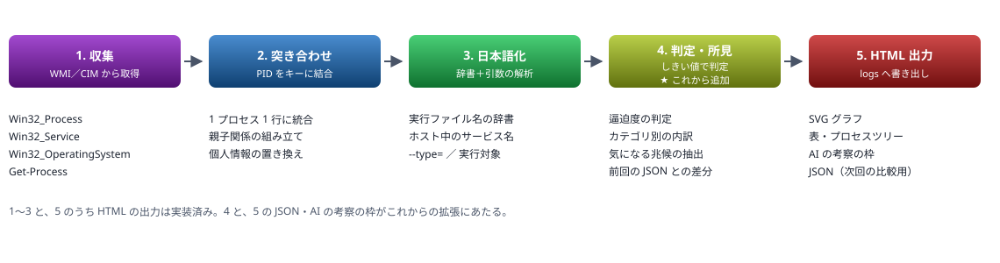
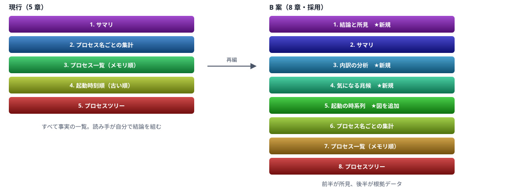

# プロセスメモリ調査ツール — 計画と出力構成

PowerShell 5.1 で全プロセスのメモリと起動時刻を調べ、HTML レポートにする

> 📅 作成: 2026-09-05 / 更新: 2026-09-28

[README へ戻る](../../README.md)

1. [この計画について](#1-この計画について)
2. [目的と方針](#2-目的と方針)
3. [取得する情報と日本語化](#3-取得する情報と日本語化)
4. [出力の仕様](#4-出力の仕様)
5. [実行環境と権限](#5-実行環境と権限)
6. [課題と考察の設計](#6-課題と考察の設計)
7. [前回との比較](#7-前回との比較)
8. [章構成の再編](#8-章構成の再編)
9. [判定ロジックとしきい値](#9-判定ロジックとしきい値)
10. [ログの保管と圧縮](#10-ログの保管と圧縮)
11. [実装の段取り](#11-実装の段取り)

## 1. この計画について

### この文書の構成

| 章 | 内容 | 状態 |
|---|---|---|
| 2〜5 | ツールの仕様。目的・取得する情報・出力・実行環境と権限 | ✅ **実装済み** |
| 6〜7 | レポートに考察と前回比較を持たせる設計 | ⬜ **未着手** |
| 8〜9 | 章構成の再編と判定のしきい値 | ⬜ **未着手** |
| 10 | 古いログの 7z 圧縮と自動実行 | ⬜ **未着手** |
| 11 | 実装の段取り | — |

### いまの成果物

| ファイル | 役割 | 文字コード |
|---|---|---|
| tools/80_ops/inspect-process-memory.ps1 | 本体 | BOM 付き UTF-8＋CRLF |
| tools/80_ops/inspect-process-memory.cmd | ダブルクリック用のランチャー | SJIS＋CRLF |
| logs/yyyymmdd-hhmmss-mem-log.html | 実行ごとの出力 | BOM なし UTF-8 |

### 決まったこと

| 論点 | 決定 | 状態 |
|---|---|---|
| 章構成 | B 案（8 章）。所見を前半、根拠データを後半に置く | ✅ **確定** |
| AI の考察の置き場 | HTML に埋め込む。別ファイルにしない | ✅ **確定** |
| 判定のしきい値 | 8 章の表の値で進める | ⚠️ **暫定** |

しきい値は運用しながら変える前提で置いている。値を変えたらこの文書の 8 章を直す。

## 2. 目的と方針

### 何のためのツールか

Windows PC で「いま何がメモリを使っているのか」「それはいつから動いているのか」を、1 回の実行で人が読める形にする。タスクマネージャーは**いまの一覧**しか見せず、起動時刻・コマンドライン・親子関係を並べて眺めることができない。それを 1 枚の HTML にまとめる。

### 方針

| 方針 | 理由 |
|---|---|
| PowerShell 5.1 で動かす | Windows に標準で入っている。PowerShell 7 のインストールを前提にしない |
| 実行のたびに記録を残す | 常駐はしない。1 回ごとに HTML と JSON を残し、次回はその JSON と比べる（[7 章](#7-前回との比較)） |
| 読むだけ。操作しない | プロセスの終了・優先度変更などの機能は持たせない |
| 出力は単独の HTML | 1 ファイルで完結させ、外部 CSS も CDN も参照しない。誰に渡してもそのまま開ける |
| ローカル固有の情報を残さない | ユーザー名・コンピューター名・実体パスを出力前に置き換える |

### 処理の流れ



## 3. 取得する情報と日本語化

### どこから何を取るか

| 取得元 | 取れるもの |
|---|---|
| Win32_Process | PID・親 PID・プロセス名・起動日時・実行ファイルのパス・コマンドライン・ワーキングセット・プライベート・仮想サイズ・スレッド数・ハンドル数・CPU 時間 |
| Win32_Service | PID からホストしているサービスの表示名（日本語ロケールなら日本語で返る） |
| Win32_OperatingSystem | 物理メモリの総量・空き・システム起動時刻・OS 名 |
| Get-Process | FileVersionInfo の説明（辞書に無いプロセスの補助として使う） |

### Get-Process を主にしない理由

起動時刻と CPU 時間は、どちらも `Get-Process` から取れる。しかし**他ユーザーや昇格したプロセスではアクセス拒否になる**。

| 欲しいもの | 使わない方 | 使う方 | 理由 |
|---|---|---|---|
| 起動時刻 | Get-Process の StartTime | Win32_Process の CreationDate | 非管理者でもほぼ全件取れる。実測でも取得不可は 0 件 |
| CPU 時間 | Get-Process の CPU | UserModeTime ＋ KernelModeTime | 同上。100ns 単位なので 1e7 で割って秒にする |

### 実行内容を日本語で補う

プロセス名だけでは何が動いているのか分からない。3 つを組み合わせて 1 つの説明文にする。

| 材料 | 中身 | 出力例 |
|---|---|---|
| 実行ファイル名の辞書 | 約 130 件。Windows のシステムプロセス・主要アプリ・開発ツール | エクスプローラー（デスクトップ・タスクバー・ファイル操作） |
| ホスト中のサービス | Win32_Service を PID で突き合わせ、表示名を並べる。4 件以上は「他 N 件」 | Windows サービスのホスト（サービス: Windows Audio） |
| コマンドラインの解析 | `--type=` の役割、`-k` のサービスグループ、スクリプトや jar の実行対象 | Google Chrome（役割: タブの描画）<br>Node.js（実行対象: index.js） |

辞書に無いものは FileVersionInfo の説明にフォールバックし、それも無ければ「不明」と書く。`--type=` は `renderer` → タブの描画、`gpu-process` → GPU 処理、のように日本語へ引き直す。

> [!NOTE]
> <strong>コマンドラインの解析は管理者権限が要る。</strong>非管理者だと 479 件中 210 件が空欄になり、Chromium 系の役割は 1 件も付かなかった。管理者で実行すると取得不可は 25 件（`Idle`・`System` など本質的に持たないもの）まで減り、役割つきが 160 件に増える。

### 親子関係の組み立て

親 PID でツリーを組むが、**PID は使い回される**。親が先に終了して同じ番号が別のプロセスに割り当てられると、無関係なものが親として繋がる。**親の起動時刻が子より後なら親とみなさない**ことで防ぐ。

循環参照に備えて深さ 20 で打ち切り、木に載らなかったプロセスは「親子関係をたどれなかったプロセス」として末尾に並べる。全件がどこかに必ず現れる。

## 4. 出力の仕様

### ファイル

| 項目 | 内容 |
|---|---|
| 置き場 | logs/yyyy/yyyymm/yyyymmdd/ |
| ファイル名 | yyyymmdd-hhmmss-mem-log.html |
| 文字コード | BOM なし UTF-8 |
| 大きさの目安 | 約 900 KB（プロセス 490 件のとき） |

実行のたびに 1 ファイル作る。追記はしない。

<strong>日付で 3 階層に分ける。</strong>1 回あたり HTML と JSON で約 1 MB あり、定期実行を始めれば 1 つのフォルダに溜まり続ける。年・月・日で切っておけば、エクスプローラーで開いたときも、古い分をまとめて捨てるときも扱える。ファイル名は階層と重複するが、単体で取り出しても日時が分かるほうがよいので短くしない。

### HTML の作り

- **単独の HTML**。CSS はすべて `<style>` に書き、外部ファイルも CDN も参照しない
- `<head>` に `<meta name="md-skip">` を入れる。Markdown 化の対象にしない
- 幅の広い表とコードは `overflow-x: auto` のラッパーで包む。ページ全体は横に伸びない
- 表は上下を詰める（`padding: 1px 10px`、表内だけ `line-height: 1.3`）。1 画面あたり 39 行が入る

### SVG グラフ

| 図 | 内容 |
|---|---|
| 物理メモリの使用状況 | 使用中（赤）と空き（緑）の積み上げ帯。凡例つき |
| メモリ上位のプロセス | 横棒。紫→赤の虹色で、バーに実行内容のツールチップを持たせる |
| プロセス名ごとの合計 | 横棒。同名をまとめた合計の多い順 |

> [!NOTE]
> <strong>SVG の座標に `{0:N1}` 書式を使ってはいけない。</strong>桁区切りのカンマが入り `width="1,094.4"` という無効な属性値になる。ブラウザはエラーを出さず、その矩形を幅ゼロで描く。座標・幅は `InvariantCulture` の `0.0` 書式で組み立てる（`Format-Coord`）。表示する数値のほうはカンマ入りでよい。

### ローカル固有情報の置き換え

| 対象 | 置き換え後 |
|---|---|
| ユーザープロファイルのパス | ~ |
| C:\Users\ 配下の名前 | C:\Users\<username> |
| ユーザー名 | <username> |
| コンピューター名 | <hostname> |
| subst の実体パス | 元のドライブ表記（X: など） |

<strong>subst の置き換えは他より先に行う。</strong>実体がユーザープロファイル配下にある環境では、先にユーザー名が伏せ字になるとドライブ表記へ戻せなくなる。

## 5. 実行環境と権限

### 文字コードと改行

| ファイル | 文字コード | 理由 |
|---|---|---|
| ps1 | BOM 付き UTF-8＋CRLF | BOM が無いと Windows PowerShell 5.1 で日本語が壊れる |
| cmd | SJIS＋CRLF | コンソールのコードページに合わせる |

### 管理者権限への昇格

コマンドラインを全件取得するため管理者権限で動かす。**昇格は ps1 が自分で行う**。cmd ランチャーは ps1 を呼ぶだけにしてある。

```batch
powershell.exe -NoProfile -ExecutionPolicy Bypass -File "%~dp0inspect-process-memory.ps1" -Open
pause
```

UAC を取り消した場合は止まらず、非管理者のまま続行する。取れる情報が減るだけで、メモリ量・起動時刻・サービス名は全件取れる。

### subst ドライブの落とし穴

> [!NOTE]
> <strong>subst で割り当てたドライブは、UAC で昇格したプロセスからは存在しない。</strong>割り当てはログオンセッション単位で、昇格トークンは別セッションとして扱われるため引き継がれない。`-File "X:\...\xxx.ps1"` を渡すとパスが解決できず、スクリプトが**起動すらしない**。ウィンドウが一瞬で閉じるだけで、エラーも残らない。

対処として、昇格する前に自分のパスを実体へ直す。`subst` の出力は「`X:\: => C:\〈実体フォルダ〉`」の形なので、正規表現 1 本で解決できる。

```powershell
function Resolve-SubstPath([string]$Path) {
	$root = [System.IO.Path]::GetPathRoot($Path)
	if (-not $root) { return $Path }
	$drive = $root.TrimEnd('\')
	if ($drive.Length -ne 2) { return $Path }

	foreach ($line in (subst)) {
		# subst の出力は「X:\: => C:\〈実体フォルダ〉」の形
		$m = [regex]::Match([string]$line, '^\s*([A-Za-z]:)\\:\s+=>\s+(.+?)\s*$')
		if ($m.Success -and $m.Groups[1].Value -eq $drive) {
			$script:FoundSubstDrive = $drive
			$script:FoundSubstRoot = $m.Groups[2].Value
			return $m.Groups[2].Value + $Path.Substring($drive.Length)
		}
	}
	return $Path
}
```

解決した対応は `-SubstDrive` / `-SubstRoot` で昇格先へ渡し、表示と出力のパスを元のドライブ表記へ戻す。**昇格先で `subst` を実行しても何も返らない**（そのセッションに割り当てが無い）ため、非管理者側で調べて渡すしかない。

### Start-Process に引数を渡すとき

> [!NOTE]
> <strong>PowerShell 5.1 の `Start-Process -ArgumentList` は、配列の要素に含まれる空白を引用符で守らない。</strong>パスに空白がある環境で分解されて壊れる。引用符を自分で入れた 1 本の文字列として渡す。

### カレントディレクトリに依存しない

昇格するとカレントは `C:\Windows\System32` になる。出力先は `$MyInvocation.MyCommand.Path` から計算しているので影響を受けない。

## 6. 課題と考察の設計

### いまの出力に足りないもの

現行の出力はすべて**事実の一覧**で、読み手が自分で問題を探すことを前提にしている。2026-09-05 の実測ではこうだった。

| 項目 | 実測値 | レポートに書かれていたか |
|---|---:|---|
| 物理メモリ 使用率 | 95.4%（15,386 / 16,130 MB） | 数値のみ。逼迫とは書いていない |
| Memory Compression | 2,961 MB | グラフの 1 位。意味の説明なし |
| svchost.exe | 99 件 / 607.8 MB | 件数のみ |
| chrome.exe | 18 件 / 1,572.6 MB | 件数のみ |
| 上位 10 種類の占有 | 9,336.6 / 12,301.1 MB＝75.9% | 出していない |
| システム稼働時間 | 8 日 18 時間 | 数値のみ |

> [!NOTE]
> <strong>足りないのは数値ではなく、数値の意味づけ。</strong>同じデータから「いま何が起きているか」「何をすれば改善するか」を導く層が無い。

### 考察を 2 つの層に分ける

**再現性のある判定**と**文脈に依存する判断**は性質が違う。一括りにすると設計できないので層を分ける。

| 層 | 誰が書くか | いつ出るか | 書けること | 書けないこと |
|---|---|---|---|---|
| レベル 1<br>ルールベースの所見 | ps1 が自動生成 | 実行のたび毎回 | しきい値で判定できるもの。逼迫度・占有率・長期稼働・多重起動・リーク疑い・回収見込み量 | 「なぜそうなっているか」。基準の妥当性そのもの |
| レベル 2<br>AI による考察 | セッションが追記 | 依頼したとき | 複数の所見をつないだ解釈。この PC の使い方を踏まえた提案。前回との比較 | 自動では出ない（毎回の実行では付かない） |

### AI の考察は HTML に埋め込む

別ファイルにせず、レポート本体の中に置く。読む人がレポート 1 枚を開けば所見も考察も揃う状態にする。

ps1 は考察を書けないので、**空の枠を出力しておき、そこへ後から追記する**形にする。枠にはコメントで目印を入れ、AI が差し込む位置を機械的に見つけられるようにする。

```html
<!-- AI:consideration -->
<p>（未記入。実行しただけではここは空欄になる）</p>
<!-- /AI:consideration -->
```

あわせて ps1 は `yyyymmdd-hhmmss-mem-data.json` を出力する（形式は [7 章](#7-前回との比較)）。AI は 900 KB の HTML を読むのではなく、この JSON を読んで考察を書き、上の枠へ差し込む。前回との比較も同じ JSON を材料にする。

### レベル 1 の観点

#### A. 全体の逼迫度

物理メモリの使用率・圧縮メモリの大きさ・コミットチャージの 3 つを合わせて 4 段階で判定する。圧縮メモリを単独で見ないのは、これが**逼迫の結果**であって原因ではないため。

#### B. 誰がメモリを使っているか

プロセスをカテゴリに束ねて内訳を出す。490 件の一覧より、6 カテゴリの積み上げのほうが原因に近い。

| カテゴリ | 含めるもの |
|---|---|
| Windows 本体 | System・Registry・Memory Compression・csrss・services・svchost・dwm・explorer など |
| セキュリティ | Microsoft Defender（MsMpEng・NisSrv）・サードパーティのウイルス対策 |
| ブラウザ | chrome・msedge・firefox・msedgewebview2 |
| 開発ツール | Code・node・powershell・pwsh・git・electron など |
| 業務アプリ | Office・Teams・Slack など |
| その他 | 辞書に無いもの |

#### C. 長く動いているもの

起動からの経過時間とメモリ量を掛け合わせる。長期稼働かつ大容量のプロセスは、終了・再起動で回収できる候補になる。「稼働が長い」だけでは所見にならない（システムプロセスは常に長い）。

#### D. 気になる兆候

ハンドル数・スレッド数・多重起動数・実行ファイルの素性を見る。ここは**断定しない**。「リークしている」ではなく「リークの疑いがある。確認するならこれを見る」と書く。単発のスナップショットでは増加傾向を測れないため。

#### E. 起動の時系列

システム起動直後（5 分以内）に立ち上がったものと、その後に立ち上がったものを分ける。前者は常駐・スタートアップ、後者はユーザー操作由来。どちらがメモリを食っているかで対処が変わる。

#### F. 回収見込み

「これを終了すると約 N MB 空く」を具体的な数値で出す。ワーキングセットの合計で概算し、共有ページの重複計上があるため**上限の目安**であることを明記する。

> [!NOTE]
> <strong>断定を避ける表現を既定にする。</strong>スナップショット 1 回から言えることには限りがある。「疑いがある」「確認するならここを見る」と書き、確定した事実（使用率・件数）と区別する。

## 7. 前回との比較

### 差分が要る理由

スナップショット 1 回では「大きい」ことしか言えず、「増えている」かどうかが分からない。9 章のリーク判定を「疑い」までしか出せないのは比較対象が無いためで、前回の記録と突き合わせれば増加を根拠のある形で示せる。

この計画で作るのは**前回 1 件との比較**まで。定期実行は将来やるが、いまは手動実行のたびに直前の記録と比べる。

### 差分の考え方


### プロセスの同定

差分を取るには「前回のあれ」と「今回のこれ」が同じプロセスだと言えなければならない。**PID と作成時刻（`CreationDate`）の 2 つを組み合わせる**のが定石で、これに従う。

| キーの候補 | 可否 | 理由 |
|---|---|---|
| PID 単独 | ❌ **不可** | プロセスが終了すると番号が別のプロセスに再利用される。一意なのは**そのプロセスが生きている間だけ** |
| プロセス名 単独 | ❌ **不可** | 同名が多数ある（実測で chrome 18 件・svchost 99 件） |
| プロセス名 ＋ 作成時刻 | ⚠️ **不十分** | 一意性を保証する仕組みが無い。PID を使えば済む話なので選ばない |
| PID ＋ 作成時刻 | ✅ **採用** | ある時点で PID が一意なことは OS が保証する。作成時刻を足すと、時間をまたいだ番号の再利用も区別できる |

#### この組み合わせが定石である根拠

- **PID の再利用は仕様**。Microsoft のドキュメントにも「プロセス識別子は再利用されることがあり、値が一意なのは関連するプロセスが実行されている間だけ。終了後は無関係なプロセスに同じ値が割り当てられうる」と明記されている
- **Sysmon の `ProcessGuid` も作成時刻を中核に置く**。マシン GUID の上位 32 ビット・プロセス作成時刻（Unix エポック秒）・ドライバ起動以降の連番、という構成になっている。PID だけでは足りないという前提で設計されている
- **OS 自身が同じ問題に手を打っている**。Windows 10 1809 以降には `PsGetProcessStartKey` があり、再利用されない一意の識別子を返す。ただし**カーネルモードのドライバ向け API で、WMI や PowerShell からは取れない**。ユーザーモードで代替するのが PID ＋ 作成時刻にあたる

PID は同定キーの一部であると同時に表示にも使う。3 章の親子関係の判定も同じ理由で「親の作成時刻が子より後なら親とみなさない」としており、考え方は一貫している。

#### 参考

- [PsGetProcessStartKey — Microsoft Learn](https://learn.microsoft.com/en-us/windows-hardware/drivers/ddi/ntddk/nf-ntddk-psgetprocessstartkey)
- [Structure of process GUIDs used in Sysmon ETW events — Microsoft Q&A](https://learn.microsoft.com/en-us/answers/questions/234884/structure-of-process-guids-used-in-sysmon-etw-even)
- [Sysmon — Sysinternals](https://learn.microsoft.com/en-us/sysinternals/downloads/sysmon)
- [Unique PID Fields and Generation — elastic/ecs](https://github.com/elastic/ecs/issues/672)

### 比較の材料は JSON にする

出力済みの HTML をパースして前回値を得る方法は取らない。表の構造を変えるたびに壊れる。**ps1 が HTML と同時に JSON を出力し、比較はそちらだけを読む。**

| 項目 | 内容 |
|---|---|
| ファイル名 | logs/yyyy/yyyymm/yyyymmdd/yyyymmdd-hhmmss-mem-data.json（HTML と同じフォルダ・同じ時刻） |
| 大きさの目安 | 約 150 KB（プロセス 490 件のとき） |
| 文字コード | BOM なし UTF-8 |
| 読み手 | 次回実行時の ps1、および考察を書く AI |

```json
{
  "schema": 1,
  "takenAt": "2026-09-05T11:20:56.4820000+09:00",
  "isAdmin": true,
  "system": {
    "totalBytes": 16916480000,
    "freeBytes": 780337152,
    "bootTime": "2026-08-28T16:50:02.0000000+09:00"
  },
  "totals": {
    "processCount": 494,
    "workingSetSum": 13901234567,
    "byCategory": { "ブラウザ": 2396000000, "Windows 本体": 3120000000 }
  },
  "processes": [
    {
      "id": 57028, "ppid": 19200, "name": "chrome.exe",
      "start": "2026-09-02T22:14:24.1230000+09:00",
      "ws": 3879731, "priv": 4102300, "threads": 23, "handles": 301,
      "cpuSec": 10.1, "category": "ブラウザ",
      "note": "Google Chrome（役割: タブの描画）"
    }
  ]
}
```

日時は ISO 8601 の文字列で持つ。`schema` は形式を変えたときに上げ、読み込み側は知らない版を見つけたら比較をあきらめて「比較不可」と書く。

### 比較する対象の選び方

- 既定では `logs` を再帰的に探し、`*-mem-data.json` のうち**今回より前で最も新しいもの**を使う。日付の階層に分かれていても、ファイル名自体に日時が入っているので名前順で選べる。フォルダの更新日時は見ない
- 日をまたいでも問題なく前日の最後の記録を拾う。月初・年初も同じ
- `-CompareWith <path>` で明示指定もできるようにする。「起動直後と比べたい」といった使い方に応える
- 前回が無ければ差分の節は出さず、「初回」と表示する

### 出す差分

| 観点 | 内容 | 出力の形 |
|---|---|---|
| 全体 | 使用率・空き・プロセス数・ワーキングセット合計 | 使用率 93.1% → 95.4%（+2.3 pt） |
| 経過 | 前回の取得からの間隔 | 前回から 17 分 14 秒 |
| カテゴリ別 | 6 カテゴリそれぞれの増減 | ブラウザ +312 MB ／ 開発ツール −45 MB |
| 継続の増減 | 両方にあるプロセスのメモリ差。増えた順に上位 | chrome.exe #57028 +120 MB（稼働 3 日 12 時間） |
| 新規起動 | 件数と合計、上位数件 | 12 件・合計 480 MB |
| 終了 | 件数と合計、上位数件 | 8 件・合計 210 MB |

### 置き場は 1 章の中

独立した章にはせず、**1 章「結論と所見」の中に「前回からの変化」の節**として置く。差分は所見の一部であり、章を分けると総合判定と往復することになる。根拠として上位数件の表を添える程度にとどめ、全件の差分表は作らない。

### この比較で言えないこと

> [!NOTE]
> <strong>2 点の比較では傾向を確定できない。</strong>1 回増えたことは、リークかもしれないし、単にその間に作業が増えただけかもしれない。所見は「前回から N MB 増えた」という事実にとどめ、「リークしている」とは書かない。連続する複数回の記録を並べて初めて傾向が言える。

### 実装で踏むであろう落とし穴

| 落とし穴 | 症状 | 対処 |
|---|---|---|
| ConvertTo-Json の -Depth が既定 2 | 入れ子が `System.Collections.Hashtable` という文字列になって出る | `-Depth 5` 以上を明示する |
| 要素 1 個の配列 | PowerShell 5.1 では読み戻したときスカラーに潰れる | 読み込み側で `@()` で包む |
| 日時のシリアライズ | DateTime をそのまま入れると環境で表現が変わる | `ToString('o')` で ISO 8601 の文字列にしてから入れる |
| 書き出しのエンコーディング | `Out-File` だと BOM が付く | HTML と同じく `[System.IO.File]::WriteAllText` で BOM なし UTF-8 |
| 個人情報 | JSON にもパスとコマンドラインが入る | HTML と同じ `Hide-Private` を通してから書く |

### 将来の定期実行に向けて

いまは仕組みを作らないが、JSON の形式が将来を縛るため、以下を満たしておく。

- **1 実行 1 ファイル**。追記型にしない。途中で壊れても他の回に影響しない
- **スキーマに版番号を持たせる**。形式を変えても古い記録を読み分けられる
- **集計値も JSON に入れる**。全プロセスを走査しなくても全体の比較ができる
- **引数だけで完結する**。タスクスケジューラから対話なしで起動できる状態を保つ

定期実行を始めると次の 2 つが要る。どちらもこの計画には含めない。

- **古いログの掃除**。1 回あたり HTML と JSON で約 1 MB。放置すると増え続ける
- **HTML を作らないモード**。定期取得では JSON だけ残し、HTML は見たいときに生成するほうが軽い

## 8. 章構成の再編

### B 案（8 章）で進める

前半を所見、後半を根拠データにする。所見の各項目から、対応する後半の章へアンカーリンクを張る。「上位 10 種類で 75.9% を占める」という所見から、その集計表へ 1 クリックで飛べるようにする。



### 各章に入るもの

| # | 章 | 中身 |
|---:|---|---|
| 1 | 結論と所見 | 総合判定のバッジ。ルールベースの所見。**前回からの変化**（[7 章](#7-前回との比較)）。**AI の考察の枠**。各項目から後半へのリンク |
| 2 | サマリ | 物理メモリの帯グラフ。システム情報。プロセス数と取得状況 |
| 3 | 内訳の分析 | カテゴリ別の積み上げ。ブラウザ・開発ツールなどの合計 |
| 4 | 気になる兆候 | 長期稼働＋大容量・ハンドル過多・多重起動・素性不明 |
| 5 | 起動の時系列 | 起動時刻のヒストグラム（図）＋起動時刻順の全件表 |
| 6 | プロセス名ごとの集計 | 現行のまま |
| 7 | プロセス一覧 | 現行のまま（メモリ順・全件） |
| 8 | プロセスツリー | 現行のまま |

### 採用しなかった案

A 案（9 章）は、起動の時系列を「図の章」と「全件表の章」に分けるもの。**2 つは同じ問いに答えるため、章を分けると読み手が往復することになる**。目次バッジも 9 個だと 2 段目が 5 個で余白が空く。B 案は 4 個 × 2 段で収まる。

### 色相の振り直し

章が 5 → 8 になるので、全章の色相を計算し直す。刻みは 280 ÷ (8 − 1) = 40。

```text
ch01  280      ch05  120
ch02  240      ch06   80
ch03  200      ch07   40
ch04  160      ch08    0
```

目次バッジの `li` にも同じクラスを付ける。一括置換のときは旧値と新値の衝突に注意する（140 が現行 ch03 と新 ch05 の両方に現れる）。

## 9. 判定ロジックとしきい値

> [!NOTE]
> <strong>ここの値は暫定。</strong>運用しながら変える前提で置いている。変えたらこの表を直す。しきい値には根拠を書き残す。書かないと、次に見た人が値を動かしてよいのか判断できない。

### 全体の逼迫度

| 判定 | 条件（物理メモリ使用率） | 根拠 |
|---|---|---|
| ✅ **余裕** | 70% 未満 | キャッシュに回せる余地がある |
| ⬜ **通常** | 70% 以上 85% 未満 | Windows は空きメモリを遊ばせないため、この帯域は正常 |
| ⚠️ **やや逼迫** | 85% 以上 93% 未満 | 圧縮とページングが増え始める |
| ❌ **逼迫** | 93% 以上 | 新しいアプリの起動で待ちが出る。2026-09-05 の実測は 93.1% → 95.4% と推移した |

圧縮メモリ（Memory Compression）が物理メモリの **10% 以上**なら、逼迫判定の裏付けとして併記する。実測は 2,961 / 16,130 ＝ 18.4% で該当した。

### 個々のプロセス

| 所見 | 条件 | 根拠と注記 |
|---|---|---|
| 大口の占有 | 単体で全体の 5% 以上 | 16 GB 環境なら約 800 MB。1 プロセスとしては十分大きい |
| 再起動の候補 | 稼働 3 日超 かつ 500 MB 超 | 常駐アプリが肥大化する典型。終了すれば回収できる |
| ハンドルリークの疑い | ハンドル 5,000 超 | 通常のアプリは数百。断定はせず「確認するならここ」と書く |
| スレッド過多 | スレッド 200 超 | スレッドプールの暴走を疑う手掛かり |
| 多重起動 | 同名 30 件超 | 実測: svchost 99 件・cmd 34 件。svchost は正常なので、判定に**除外リスト**が要る |
| 素性が不明 | 実行ファイルのパスが取れない、または Temp・ダウンロードフォルダ配下から起動 | 非管理者で実行するとシステムプロセスが軒並み該当してしまう。**管理者実行時のみ**判定する |

> [!NOTE]
> <strong>svchost.exe の 99 件は正常。</strong>多重起動の判定をそのまま適用すると必ず最上位に出る。Windows が意図的にサービスを分離しているためで、除外リスト（svchost・conhost・cmd・RuntimeBroker 等）を持たないと所見が使いものにならない。

### この方法で測れないもの

- **増加傾向**。スナップショット 1 回では、リークしているのか元から大きいのか区別できない。判定は「疑い」までにとどめる
- **実際の占有量**。ワーキングセットは共有ページを各プロセスで重複計上する。合計は実際の消費より大きく出る（実測: 合計 12,301 MB に対し、OS 報告の使用中は 15,013 MB。共有分と非プロセス領域で差が出る）
- **回収できる正確な量**。「終了すれば N MB 空く」は上限の目安として書く

## 10. ログの保管と圧縮

### やること

日単位のフォルダの**更新日時が 1 週間以上前**になったら 7z にまとめ、元のフォルダを削除する。夜間にタスクスケジューラで自動実行する。

```text
logs/2026/202609/20260905/     ← 7 日以上前になったら
logs/2026/202609/20260905.7z   ← こうして、フォルダは消す
```

7z は日フォルダと同じ階層（月フォルダの中）に置く。年・月の階層はそのまま残す。

### 圧縮率と所要時間

2026-09-05 のログ 4 ファイル 3,457,415 バイトで実測した。

| 圧縮レベル | 圧縮後 | 比率 | 所要時間 |
|---|---:|---:|---:|
| -mx=1 | 350,777 バイト | 10.1% | 0.12 秒 |
| -mx=5（採用） | 155,130 バイト | 4.5% | 0.37 秒 |
| -mx=9 | 135,462 バイト | 3.9% | 0.48 秒 |

同じ日のレポートは構造も内容もよく似ているため、まとめると 20 分の 1 以下になる。**-mx=9 にしても 0.6 ポイントしか縮まない**ので、既定の -mx=5 を使う。

### 判定はフォルダの更新日時で行う

対象は `logs` 配下の `yyyymmdd` という名前のフォルダで、`LastWriteTime` が 7 日以上前のもの。フォルダ名の日付ではなく更新日時を見る。

#### 展開しても、また圧縮される

7z はフォルダのタイムスタンプを保存し、展開時に復元する。実測では、更新日時を 2026-01-01 にしたフォルダを圧縮・削除・展開したところ、展開後も 2026-01-01 のまま復元された。**中を見るために展開しても、次の夜にまた圧縮・削除される。**

> [!NOTE]
> <strong>フォルダ自体をアーカイブに含めて圧縮する。</strong>中身だけを対象にするとフォルダのタイムスタンプがアーカイブに入らず、展開したときの更新日時が「いま」になる。そうなると 7 日経つまで再圧縮されず、上の挙動が成り立たなくなる。

### 手順

1. `logs` を再帰的に探し、`yyyymmdd` 形式のフォルダのうち更新日時が 7 日以上前のものを集める
2. 7z で圧縮する（`-t7z -mx=5`）
3. **`7z t` で検査する**
4. 検査が通ったときだけ元のフォルダを削除する
5. 処理した件数と削減量を標準出力に書く

> [!NOTE]
> <strong>検査に通らなければ削除しない。</strong>圧縮に失敗しているのにフォルダを消すと、記録が丸ごと失われる。圧縮 → 検査 → 削除の順を崩さない。

### 既に 7z がある場合は上書きする

展開して中を見たあと、次の夜に再圧縮するときは同名の 7z が既にある。<strong>そのまま上書きする。</strong>フォルダの中身が正であり、展開後に足したファイルも含めて圧縮される。中身を意図的に減らした場合もその状態が保たれる。

### 7z が見つからないとき

`7z.exe` を PATH → `Program Files\7-Zip` → `Program Files (x86)\7-Zip` の順に探す。見つからなければ**何もせずに警告を出して終わる**。zip へのフォールバックはしない。形式が混ざると後から扱いに困る。

### 前回との比較への影響

圧縮されるのは 7 日以上前のものなので、[7 章](#7-前回との比較)の比較で使う直近の JSON は通常そのまま残っている。

<strong>7z の中は探さない。</strong>1 週間以上あけて実行した場合は比較対象が見つからず「初回」として扱う。中を見たければ手で展開すればよく、そのために処理を複雑にしない。

### 実行方法

| ファイル | 役割 |
|---|---|
| tools/80_ops/archive-old-logs.ps1 | 圧縮の本体 |
| tools/80_ops/archive-old-logs.cmd | 手で実行するときのランチャー |
| tools/80_ops/register-archive-task.ps1 | タスクスケジューラへの登録 |
| tools/80_ops/register-archive-task.cmd | 同上のランチャー |

- 実行時刻の既定は深夜 3 時。`-At` で変えられるようにする
- 登録はユーザー単位のタスクにする。管理者権限は要らない（自分のファイルを触るだけ）
- <strong>subst ドライブの問題がここにも出る。</strong>タスクスケジューラは別のログオンセッションで動くため `X:` が見えない。登録時に実体パスへ直しておく（[5 章](#5-実行環境と権限)の `Resolve-SubstPath` を使う）
- 何度実行しても結果は同じ。圧縮済みのフォルダはもう存在しないため、二重に処理されない

### 7z 自体は消さない

1 日あたり 155 KB 程度で、5 年ためても数百 MB に収まる。保持期間の管理は作らない。

## 11. 実装の段取り

### 済んでいるもの

| やったこと | 状態 |
|---|---|
| 収集・突き合わせ・親子関係の組み立て | ✅ **済** |
| 実行内容の日本語化（辞書・サービス名・引数の解析） | ✅ **済** |
| 5 章構成の HTML 出力・SVG グラフ 3 点 | ✅ **済** |
| ローカル固有情報の置き換え | ✅ **済** |
| 管理者権限への自己昇格・subst ドライブの解決 | ✅ **済** |
| 表の行間を詰める | ✅ **済** |

### これからやること

1 点ずつ実装し、各段階で全体を再生成して確認する。

| # | やること | 触る場所 | 確認方法 |
|---:|---|---|---|
| 1 | カテゴリ分類の辞書とマッピング関数を追加 | ps1（辞書部） | 6 カテゴリの合計が総計と一致するか |
| 2 | JSON 出力の追加（差分比較と AI の考察の土台になるため先に作る） | ps1（書き出し部） | 読み戻して件数・合計が HTML と一致するか |
| 3 | 所見の生成ロジック（しきい値判定・除外リスト） | ps1（新関数） | 実測値で期待どおりの判定が出るか |
| 4 | 前回との差分計算（同定・全体・カテゴリ別・継続の増減） | ps1（新関数） | 2 回続けて実行し、差分の件数が実際と合うか。前回が無い場合に「初回」と出るか |
| 5 | 1 章「結論と所見」を追加（前回からの変化・AI の考察の枠を含む） | ps1（HTML 組み立て） | ブラウザ表示・コントラスト検証 |
| 6 | 3 章「内訳の分析」＋カテゴリ別の積み上げ SVG | ps1（SVG 関数） | 幅の合計が 100% になるか |
| 7 | 4 章「気になる兆候」 | ps1 | 除外リストが効いているか |
| 8 | 5 章「起動の時系列」＋ヒストグラム SVG | ps1（SVG 関数） | 起動直後の山が出るか |
| 9 | 章の並べ替えと色相の振り直し（8 章・刻み 40°） | ps1（CSS・目次） | 目次バッジと章見出しの色が一致するか |
| 10 | 古いログの 7z 圧縮（[10 章](#10-ログの保管と圧縮)） | archive-old-logs.ps1 ＋ cmd | 更新日時を過去にしたフォルダで、圧縮 → 検査 → 削除が通るか。展開して再実行しても同じ結果になるか |
| 11 | タスクスケジューラへの登録 | register-archive-task.ps1 ＋ cmd | 登録されたタスクのパスが実体パスになっているか。手動実行で動くか |

### この計画でやらないこと

- **定期実行**。タスクスケジューラへの登録や常駐の仕組みは作らない。JSON の形式だけ将来に耐える形にしておく（[7 章](#7-前回との比較)）
- **3 回以上の傾向分析**。今回は前回 1 件との比較まで。連続した記録から傾向を出すのは定期実行が動いてから
- **7z の保持期間の管理**。圧縮までは作るが、古い 7z を捨てる仕組みは作らない（[10 章](#10-ログの保管と圧縮)）
- **プロセスの操作**。終了・優先度変更などレポートから実行する機能は持たせない。読むだけに徹する

[README へ戻る](../../README.md) プロセスメモリ調査 ／ 計画: ツールの仕様と出力構成
